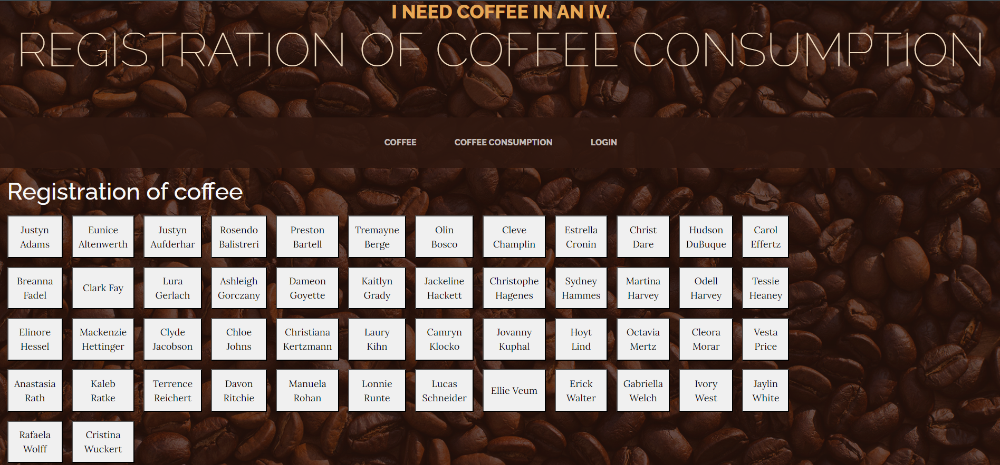
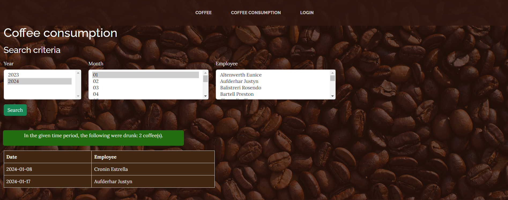
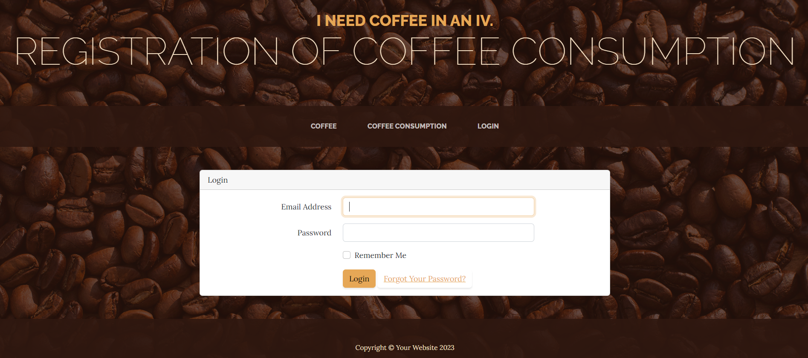
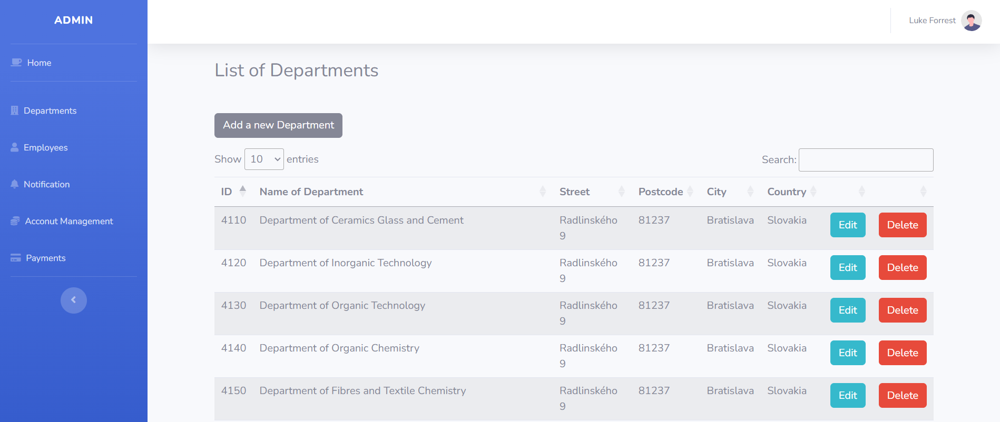
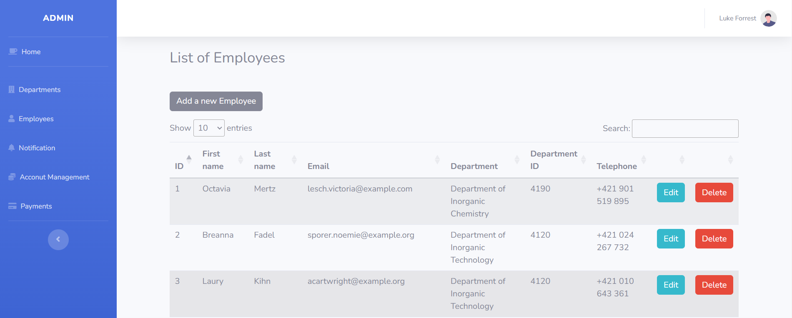
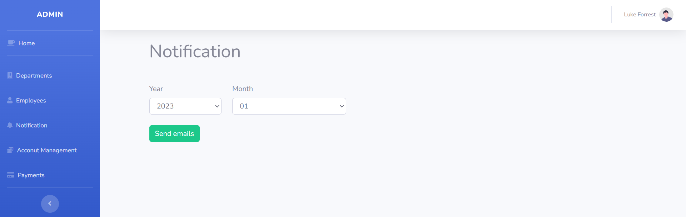
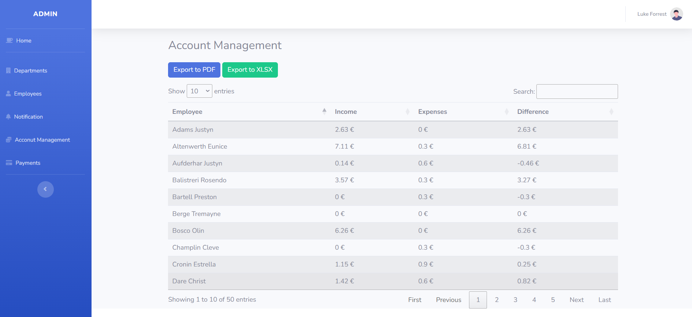
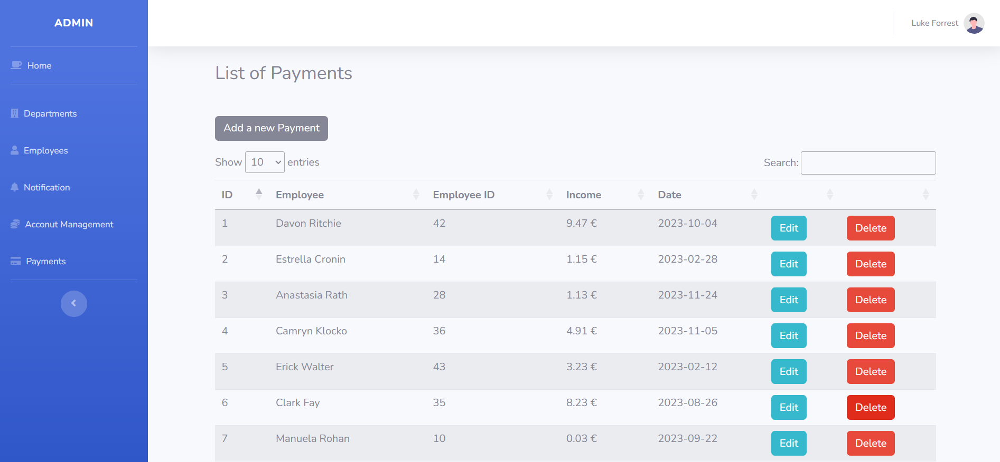
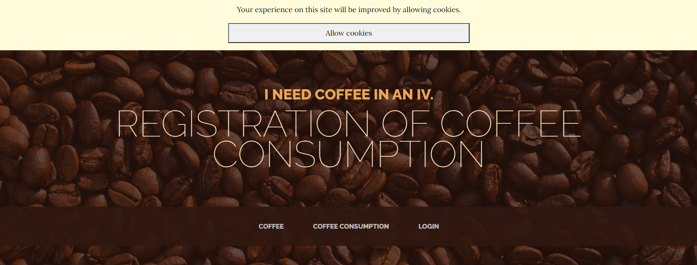

## About

The web application is used for recording the coffee consumption by employees who are assigned to various departments. All employees and their data were created using the fake() function. The application is divided into a public and a non-public part.

Public part:

- Coffee (homepage).
- Coffee Consumption (overview).
- Login

Non-public part:
- Departments (CRUD) 
- Employees (CRUD)
- Notification
- Account Management
- Payments (CRUD)

## Coffee

The Coffee section displays a page with buttons showing the names of active employees. Clicking on an employee's name records the consumption of one coffee along with the date.

## Coffee Consumption

The application displays a page with a form that includes the selection of the month, year, and employee. Upon submission, an overview of the employee's coffee consumption for the specified period (list of times) and the total number of coffees is displayed.

## Login

The non-public part is accessible after logging in. I have created a login form for this purpose. After logging into their account, the admin can manage the sections in the non-public part of the application.

## Departments

Complete department management (Create, Read, Update, Delete (CRUD)).

## Employees

Complete employees management (CRUD).

## Notification

A webpage that includes a month selection and a button to send an email. The email contains the following message:

    Dobrý deň *NAME*,

  
za mesiac *MONTH* evidujeme spotrebu kávy v počte *COFFEE NUMBER*.
 
            Sumu *COFFEE NUMBER x 0.3* € musíte uhradiť do *CURRENT DAY+ 7 DAYS*.
 
            Váš aktuálny zostatok na účte je *BALANCE ON THE ACCOUNT* €.

    S pozdravom, Administrátor. 

## Account Management

The webpage displays all employees in a table format with the following columns: Last Name | First Name | Income | Expenses | Difference. Additionally, it includes buttons to export the list to PDF and XLSX formats.

## Payments

Complete payment management (CRUD) - credit creation.

## Cookies

Implementation of cookie consent.

